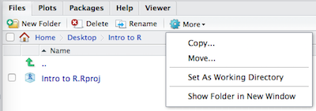
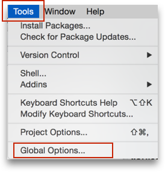
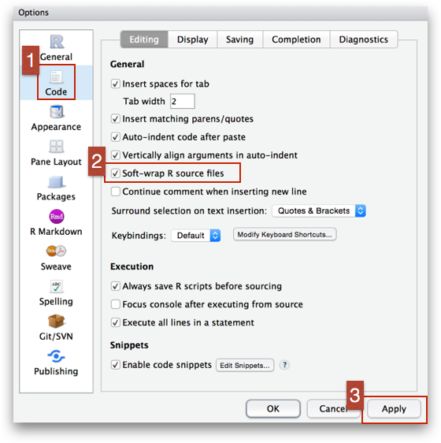

## Creating a new project directory in RStudio

Let's create a new project directory for our "Introduction to R" lesson today. 

1. Open RStudio
2. Go to the `File` menu and select `New Project`.
3. In the `New Project` window, choose `New Directory`. Then, choose `Empty Project`. Name your new directory `Intro-to-R` and then "Create the project as subdirectory of:" the Desktop (or location of your choice).
4. Click on `Create Project`.
5. After your project is completed, if the project does not automatically open in RStudio, then go to the `File` menu, select `Open Project`, and choose `Intro-to-R.Rproj`.
6. When RStudio opens, you will see three panels in the window.
7. Go to the `File` menu and select `New File`, and select `R Script`. The RStudio interface should now look like the screenshot below.


## RStudio Interface

**The RStudio interface has four main panels:**

1. **Console**: where you can type commands and see output. *The console is all you would see if you ran R in the command line without RStudio.*
2. **Script editor**: where you can type out commands and save to file. You can also submit the commands to run in the console.
3. **Environment/History**: environment shows all active objects and history keeps track of all commands run in console
4. **Files/Plots/Packages/Help**

## Organizing your working directory & setting up

### Viewing your working directory

Before we organize our working directory, let's check to see where our current working directory is located by typing into the console:

```r
getwd()
```

Your working directory should be the `Intro-to-R` folder constructed when you created the project. The working directory is where RStudio will automatically look for any files you bring in and where it will automatically save any files you create, unless otherwise specified. 

You can visualize your working directory by selecting the `Files` tab from the **Files/Plots/Packages/Help** window. 


If you wanted to choose a different directory to be your working directory, you could navigate to a different folder in the `Files` tab, then, click on the `More` dropdown menu and select `Set As Working Directory`.
 



### Structuring your working directory
To organize your working directory for a particular analysis, you should separate the original data (raw data) from intermediate datasets. For instance, you may want to create a `data/` directory within your working directory that stores the raw data, and have a `results/` directory for intermediate datasets and a `figures/` directory for the plots you will generate.

Let's create these three directories within your working directory by clicking on `New Folder` within the `Files` tab. 


When finished, your working directory should look like:


### Setting up 

This is more of a housekeeping task. We will be writing long lines of code in our script editor and want to make sure that the lines "wrap" and you don't have to scroll back and forth to look at your long line of code.

Click on "Tools" at the top of your RStudio screen and click on "Global Options" in the pull down menu.



On the left, select "Code" and put a check against "Soft-wrap R source files". Make sure you click the "Apply" button at the bottom of the Window before saying "OK".



